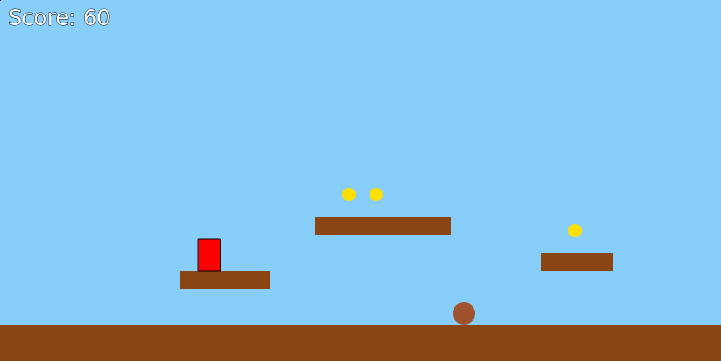
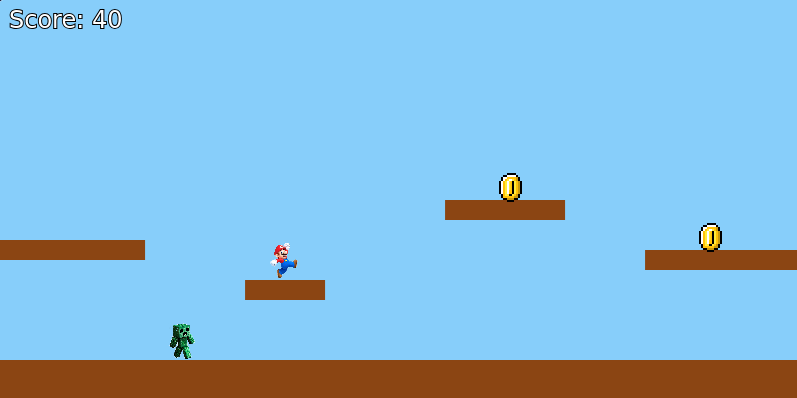
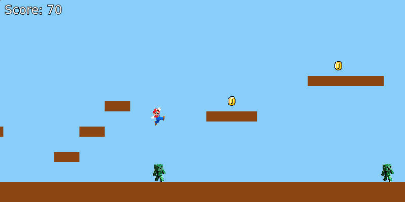

# vibeCodingExploration
An exploration of using AI to bring new things to life

## MarioP5js
A very basic, minimalistic proof of concept of creation of a platform 2D game using Gemini 2.5 Pro. This exploration comprehends 3 iterations each labeled `code_vX_description`. Each file needs to be added to `index.html` in the respective section to make it work. 

### Versions

Here is a basic explanation of what happends in each section: 
- `code_v1_base.js`: 

this basic implementation uses geometric figured to define the main character (rectangle), coins (yellow circles) and enemies (brown circles). The scenario is short and simple. Goal is to reach the end without being touched by an enemy. Every coin adds points toward the end game.  

- `code_v2_sprites.js`:

This improvement adds images for the main character, enemies and coins. Images had to be resized to keep the proportions in check. 

- `code_v3_sprites_sounds.js`:

This final version adds sounds and redefines proportion of base images. Scenario is the same as in v1 and v2.

### Usage
For each version of the game, add the `js` file to `script` section in the `body` tag of `index.html`

